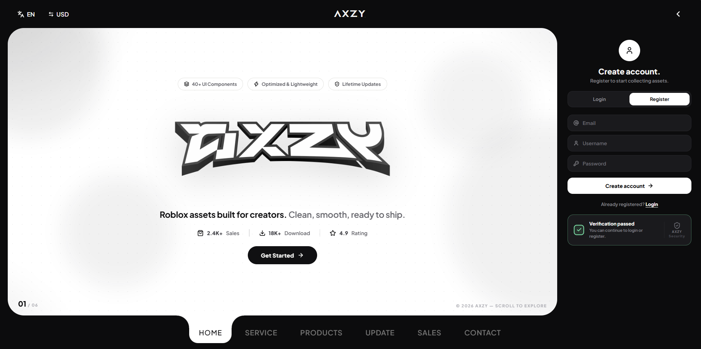
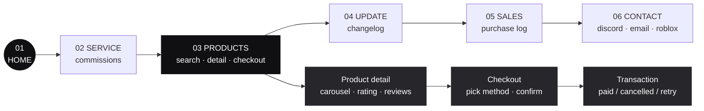

<div align="center">



# AXZY — Store Web Modern

**Modern one-page store for Roblox assets — horizontal page slider, animated UI, zero vertical scroll.**

[](https://react.dev)
[](https://vitejs.dev)
[](https://www.typescriptlang.org)
[](https://www.framer.com/motion/)

[](LICENSE)
[](#)
[](#)

</div>

---

## Features

| | Feature | Description |
|---|---------|-------------|
|  | **Horizontal navigation** | Mouse wheel, arrow keys, and touch swipe slide between pages — no vertical page scroll |
|  | **Reveal animations** | Every page replays its entrance animation on visit; sliding nav pill "tears" down from the panel |
|  | **Full store flow** | Product grid with live search → detail (carousel, rating, reviews) → checkout → transaction status |
|  | **Payment methods** | QRIS · E-Wallet (DANA/GoPay/OVO) · Crypto · PayPal, with check-status / switch-method / cancel |
|  | **Profile sidebar** | Login/register with anti-bot check, activity chart, paginated licenses, edit profile (name + password) |
|  | **Sales log** | Expandable purchase rows with payment method, transaction ID, and status |
|  | **Layered background** | Dot grid, dark blush radials, and floating blurred circles keep the panel alive |
|  | **Hash routing** | Deep-link straight to any page: `/#products`, `/#sales`, `/#contact` |

## Pages



## Quick start

```bash
git clone https://github.com/Arifxyzzz/Store-Modern.git
cd Store-Modern
npm install
cp .env.example .env   # then edit the dummy credentials
npm run dev
```

| Script | Description |
|--------|-------------|
| `npm run dev` | Start dev server (Vite) |
| `npm run build` | Type-check + production build |
| `npm run preview` | Preview the production build |

### Local auth (frontend-only)

Login is validated against `.env` values — no backend needed while developing:

```env
VITE_AUTH_EMAIL=you@example.com
VITE_AUTH_USERNAME=YourName
VITE_AUTH_PASSWORD=yourpassword
```

## Tech stack

```
react 18 · vite 6 · typescript 5 · framer-motion · lucide-react
```

```
src/
├── App.tsx              # shell: header, pager, footer nav, wheel/key/touch handlers
├── data.ts              # products, services, purchases, reviews, licenses
├── components/
│   ├── Reveal.tsx       # scroll-in reveal wrapper
│   ├── ProfileAside.tsx # auth + profile + edit-profile sidebar
│   ├── ProductDetail.tsx# carousel, rating, specs, reviews
│   └── Checkout.tsx     # payment method picker + transaction status
├── pages/               # Home · Service · Products · Update · Sales · Contact
└── styles/global.css    # design system, all styling
```

## License

Released under the [MIT License](LICENSE) — free to use, modify, and distribute.

<div align="center">

Made by [**Arifxyzzz**](https://github.com/Arifxyzzz)

</div>
